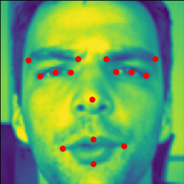

# ResNet Facial Feature Detection

### input


Ailia input shape: (1, 1, 226, 226)  
Range: [0, 1]

### output


The raw output of our model is a list of 15 coordinates of feature points.  


### usage
Automatically downloads the onnx and prototxt files on the first run.
It is necessary to be connected to the Internet while downloading.

For the sample image,
``` bash
$ python3 facial_feature.py 
```

If you want to specify the input image, put the image path after the `--input` option.  
You can use `--savepath` option to change the name of the output file to save.
```bash
$ python3 facial_feature.py --input IMAGE_PATH --savepath SAVE_IMAGE_PATH
```

By adding the `--video` option, you can input the video.   
If you pass `0` as an argument to VIDEO_PATH, you can use the webcam input instead of the video file.
```bash
$ python3 facial_feature.py --video VIDEO_PATH
```

### Reference
[kaggle-facial-keypoints](https://github.com/axinc-ai/kaggle-facial-keypoints)

### Framework
PyTorch 1.2.0

### Model Format
ONNX opset = 10

### Netron

[resnet_facial_feature.onnx.prototxt](https://netron.app/?url=https://storage.googleapis.com/ailia-models/resnet_facial_feature/resnet_facial_feature.onnx.prototxt)
