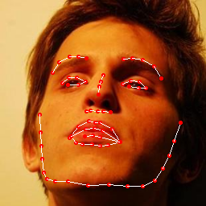
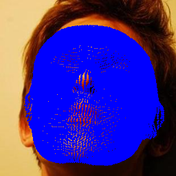

# PRNet -Joint 3D Face Reconstruction and Dense Alignment with Position Map Regression Network-

### input
- original image  
  
(from https://github.com/YadiraF/PRNet/tree/master/TestImages/AFLW2000)

- Before feeding the image into the model, the face dectection model (e.g., [yolov3-face](https://github.com/axinc-ai/ailia-models/tree/master/yolov3-face))
 must be applied to extract appropriately sized (256 * 256) face images.  
 
 
- Ailia input shape: (1, 256, 256, 3)  
- Range: [0, 1]

### output
1. face alignment mode  




2. texture editing mode  


### usage
Automatically downloads the onnx and prototxt files on the first run.
It is necessary to be connected to the Internet while downloading.

We propose mainly two different modes.
1. face alignment mode
2. texture editing mode

---

Here's how to use `face_alignment` mode.
For the sample image,
``` bash
$ python3 prnet.py
```

If you want to specify the input image, put the image path after the `--input` option.  
```bash
$ python3 prnet.py --input IMAGE_PATH
```

Add `--isMat`, `--isKpt`, `--isPose`, `--isFront`, `--isDepth`, `--isTexture`, `--isMask` depending on what you want to generate.  
`--isShow` argument shows the results instead of saving them.

Run `python3 prnet.py -h` for more details.

---

Then, `texture editing` mode.  
To activate this mode, you must give `0` or `1` to the `--texture` argument. (`0` for modifying eyes, `1` for changing whole parts.)  
And you need to specify two images as one input image and one reference image.  
By default, Donald Trump's face is used as the reference image.

```python3
python3 prnet.py --texture 1 --input IMAGE_PATH --refpath REF_IMAGE_PATH
```


### Reference
[Joint 3D Face Reconstruction and Dense Alignment with Position Map Regression Network](https://github.com/YadiraF/PRNet)


### Framework
Tensorflow 1.4


### Model Format
ONNX opset = 10


### Netron

[prnet.onnx.prototxt](https://netron.app/?url=https://storage.googleapis.com/ailia-models/prnet/prnet.onnx.prototxt)
