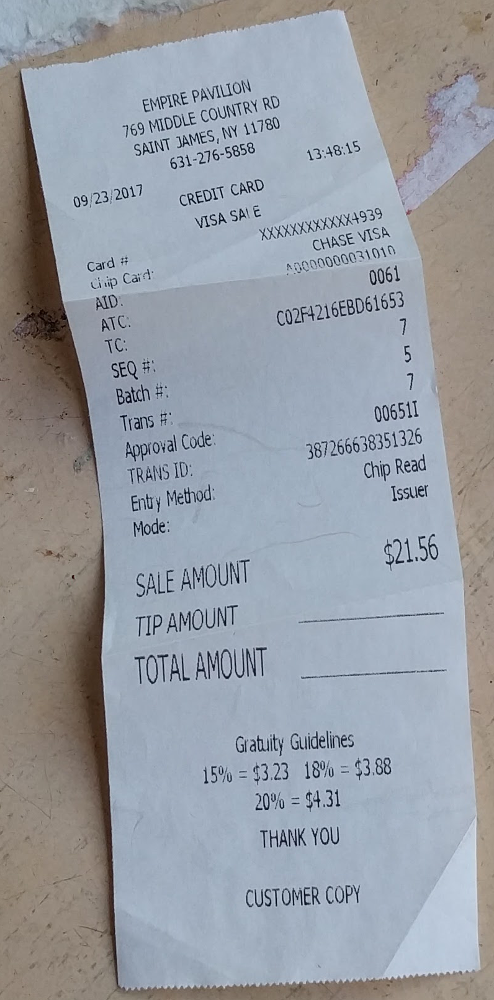
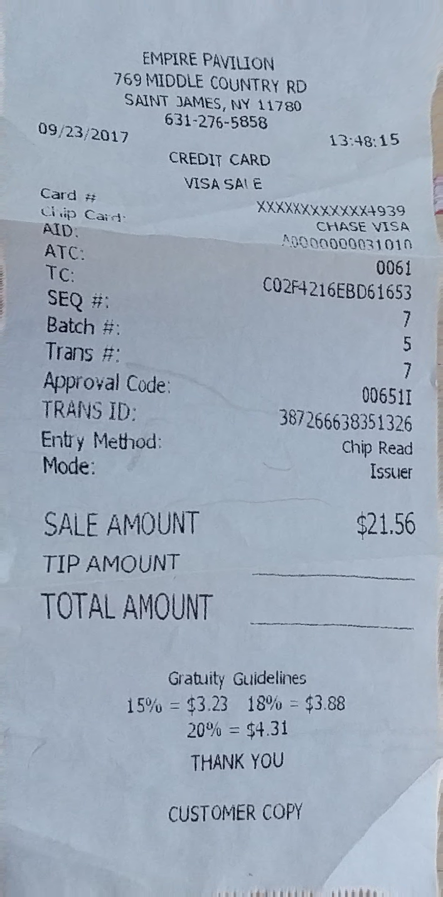

# DewarpNet

## Input
<!--  -->


(from https://github.com/cvlab-stonybrook/DewarpNet/tree/master/eval/inp)

Ailia input shape: (1, 3, 256, 256)  
Range: [0, 1]

## Output
<!--  -->


## Usage
Automatically downloads the onnx and prototxt files on the first run.
It is necessary to be connected to the Internet while downloading.

For the sample image,
``` bash
python3 dewarpnet.py 
```

If you want to specify the input image, put the image path after the `--input` option.  
You can use `--savepath` option to change the name of the output file to save.
```bash
$ python3 dewarpnet.py --input IMAGE_PATH --savepath SAVE_IMAGE_PATH
```

By adding the `--video` option, you can input the video. 
If you pass `0` as an argument to VIDEO_PATH, you can use the webcam input instead of the video file.
```bash
$ python3 dewarpnet.py --video VIDEO_PATH
```

## Reference
[DewarpNet: Single-Image Document Unwarping With Stacked 3D and 2D Regression Networks](https://github.com/cvlab-stonybrook/DewarpNet)

## Framework
PyTorch 1.3.1

## Model Format
ONNX opset = 10

## Netron

[bm_model.onnx.prototxt](https://netron.app/?url=https://storage.googleapis.com/ailia-models/dewarpnet/bm_model.onnx.prototxt)

[wc_model.opt.onnx.prototxt](https://netron.app/?url=https://storage.googleapis.com/ailia-models/dewarpnet/wc_model.onnx.prototxt)

