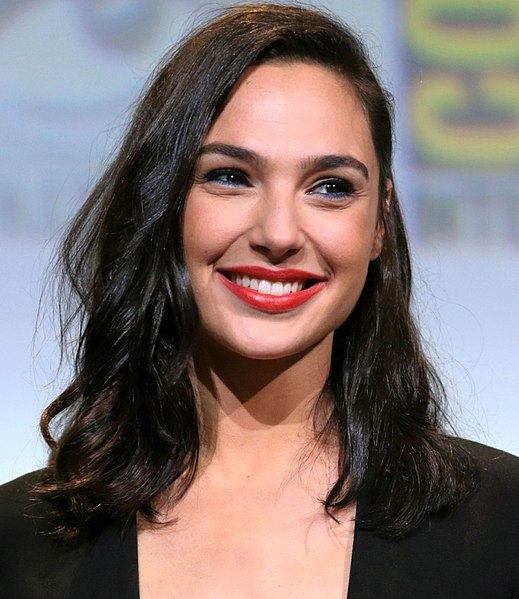
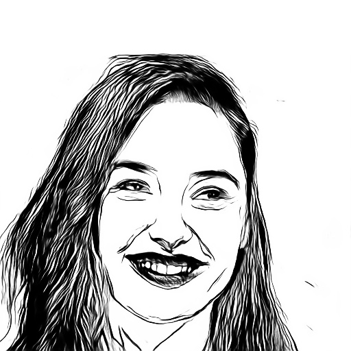

# U^2-Net for human portrait drawing

## Input



(Image above is from [https://github.com/NathanUA/U-2-Net](https://github.com/NathanUA/U-2-Net))

## Output



## Usage
Automatically downloads the onnx and prototxt files on the first run.
It is necessary to be connected to the Internet while downloading.

For the sample image,
```
$ python3 u2net.py
```

If you want to specify the input image, put the image path after the `--input` option.  
You can use `--savepath` option to change the name of the output file to save.
```
$ python3 u2net.py --input IMAGE_PATH --savepath SAVE_IMAGE_PATH
```

By adding the `--video` option, you can input the video.   
If you pass `0` as an argument to VIDEO_PATH, you can use the webcam input instead of the video file.
```
$ python3 u2net.py --video VIDEO_PATH
```

## Reference

- [U^2-Net: Going Deeper with Nested U-Structure for Salient Object Detection
](https://github.com/NathanUA/U-2-Net)

## Framework

PyTorch >= 0.4.0

## Model Format

ONNX opset=10

## Netron

[u2net_portrait.onnx.prototxt](https://netron.app/?url=https://storage.googleapis.com/ailia-models/u2net_portrait/u2net_portrait.onnx.prototxt)

