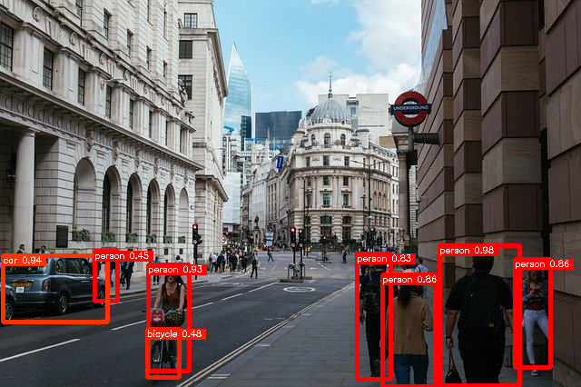

# yolov4-tiny

## Input


(Image from https://pixabay.com/ja/photos/%E3%83%AD%E3%83%B3%E3%83%89%E3%83%B3%E5%B8%82-%E9%8A%80%E8%A1%8C-%E3%83%AD%E3%83%B3%E3%83%89%E3%83%B3-4481399/)

Shape : (batch_size, 3, 416, 416)  
Range : [0.0, 1.0]

## Output



- boxes shape : (batch_size, 2535, 1, position)
- confs shape : (batch_size, 2535, category_probability)
- category_probability : [probability, ] * 80
- probability : [0.0,1.0]
- position : left, top, right, bottom [0,1]

## usage
Automatically downloads the onnx and prototxt files on the first run.
It is necessary to be connected to the Internet while downloading.

For the sample image,
``` bash
$ python3 yolov4-tiny.py
```

If you want to specify the input image, put the image path after the `--input` option.  
You can use `--savepath` option to change the name of the output file to save.
```bash
$ python3 yolov4-tiny.py --input IMAGE_PATH --savepath SAVE_IMAGE_PATH
```

By adding the `--video` option, you can input the video.   
If you pass `0` as an argument to VIDEO_PATH, you can use the webcam input instead of the video file.
```bash
$ python3 yolov4-tiny.py --video VIDEO_PATH
```

## Reference

- [Pytorch-YOLOv4](https://github.com/Tianxiaomo/pytorch-YOLOv4)

- [YOLOv4-tiny released](https://github.com/Tianxiaomo/pytorch-YOLOv4/issues/125)

- [Yolo v4, v3 and v2 for Windows and Linux](https://github.com/AlexeyAB/darknet)

## Framework

Pytorch

## Model Format

ONNX opset=11

## Netron

[yolov4-tiny.onnx.prototxt](https://netron.app/?url=https://storage.googleapis.com/ailia-models/yolov4-tiny/yolov4-tiny.onnx.prototxt)
